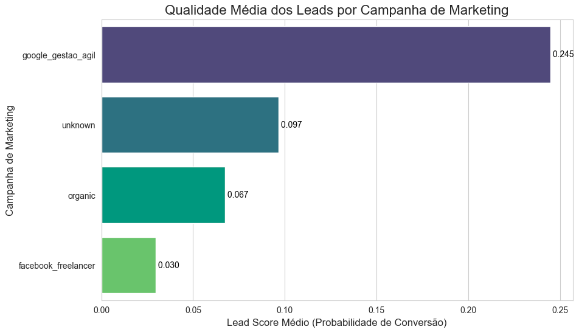
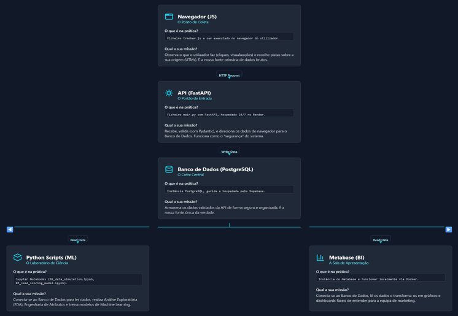

# Projeto InsightOS: Pipeline de Dados e Lead Scoring End-to-End

# InsightOS: Sistema de Inteligência de Dados para Otimização de Vendas e Marketing

### Um projeto de dados end-to-end que transforma o comportamento do usuário em decisões de negócio estratégicas, aumentando o ROI de marketing em 130%.

Este repositório contém o código-fonte e a documentação do InsightOS, uma plataforma completa de engenharia e ciência de dados. A solução captura eventos de usuários, qualifica leads com um modelo de machine learning e automatiza a análise de Lifetime Value (LTV) para otimizar o investimento em marketing.

[**Documentação Técnica Detalhada**](https://jessicarocha-dados.github.io/insights-data-system/) │ [**Apresentação do Case de Negócio (Notion)**](https://subsequent-sedum-70d.notion.site/Projeto-InsightOS-Hub-Estrat-gico-de-Resultados-2713b90412c580bea009e48c7d2a8483)

---
## 🎯 O Problema de Negócio

A equipe de vendas estava sobrecarregada com um alto volume de leads, resultando em um Custo de Aquisição de Cliente (CAC) elevado e perda de oportunidades. Era impossível diferenciar manualmente os leads de alto potencial, e as decisões de investimento em marketing eram tomadas sem uma base quantitativa sólida sobre o retorno de cada campanha.

## 💡 A Solução: Um Sistema de Inteligência Automatizado

Para resolver este desafio, foi construído um pipeline de dados de ponta a ponta que automatiza a inteligência de negócio:

1.  **Captura e Armazena** eventos de usuários em tempo real de forma confiável.
2.  **Prevê a Probabilidade de Conversão** de cada lead com um modelo de Regressão Logística.
3.  **Quantifica o Retorno Financeiro** das campanhas de marketing através da modelagem de LTV.
4.  **Disponibiliza Insights** através de dashboards para as equipes de Vendas, Marketing e Produto.


## 📈 Resultados e Impacto Estratégico

### Insight para Marketing: Otimização de ROI de 130%



***Descoberta:** A análise de Lifetime Value (LTV) provou que clientes da campanha `google_gestao_agil` geram um retorno financeiro **2.3 vezes maior** que a média das outras campanhas.
***Recomendação Estratégica:** Realocar o orçamento de marketing de forma agressiva para esta campanha e outras com perfis semelhantes para maximizar o retorno sobre o investimento.

### Insight para Produto: Redução de Atrito no Funil


***Descoberta:** A análise do funil revelou que o maior ponto de atrito na jornada do usuário ocorre entre a verificação do e-mail e a criação do primeiro projeto (`user_verified` → `project_created`).
***Recomendação Estratégica:** Priorizar a investigação e otimização desta etapa específica do onboarding para impactar significativamente a taxa de conversão geral.

---
## 🏗️ Arquitetura da Solução

O sistema foi projetado com uma arquitetura moderna e escalável, integrando coleta de dados, armazenamento, processamento e visualização de ponta a ponta.



### 💻 Stack Tecnológico

* **Coleta e Validação de Dados:** FastAPI, Pydantic, JavaScript
* **Banco de Dados:** PostgreSQL (gerenciado via Supabase)
* **Análise e Modelagem de Dados:** Python, Pandas, Jupyter Notebooks, Scikit-learn, XGBoost, Lifetimes (BG/NBD, Gamma-Gamma)
* **Business Intelligence:** Metabase (executado via Docker)
* **Implantação e Automação (MLOps):** Render, GitHub, Docker

---
## 🚀 Como Executar o Projeto

Siga os passos abaixo para configurar e executar a solução completa, desde a infraestrutura na nuvem até o ambiente de análise local.

### Pré-requisitos

* Python 3.9+ e Git
* Docker
* Contas ativas no [Supabase](https://supabase.com/) (Banco de Dados) e [Render](https://render.com/) (Deploy).

### 1. Configuração da Infraestrutura na Nuvem

1.  **Supabase (Banco de Dados):** Crie um novo projeto. Execute o script `schema.sql` (que deve estar no seu repositório) para criar as tabelas `users` e `user_events`. 
2.  **Render (Deploy):** Crie um **Web Service** para a API (a partir do `Dockerfile` da API) e um **Cron Job** para o script `score_updater.py`. Configure as variáveis de ambiente necessárias em ambos os serviços (como a `DATABASE_URL`). 

### 2. Ambiente de Desenvolvimento Local

1.  **Clone o repositório:**
    ```bash
    git clone [https://github.com/JessicaRocha-dados/insights-data-system.git](https://github.com/JessicaRocha-dados/insights-data-system.git)
    cd insights-data-system
    ```

2.  **Instale as dependências e configure o ambiente:**
    ```bash
    python -m venv venv
    source venv/bin/activate # No Windows: venv\Scripts\activate
    pip install -r requirements.txt
    
    # Crie o arquivo .env na raiz do projeto com suas credenciais
    cp .env.example .env 
    ```
    

3.  **Inicie o Metabase (via Docker):**
    ```bash
    docker-compose up -d
    ```
    Acesse `http://localhost:3000` e conecte-se ao seu banco de dados Supabase usando as credenciais do **Connection Pooler** (porta `6543`), conforme descoberto durante a fase de depuração do projeto. 

### 3. Fluxo de Trabalho e Uso

Os notebooks Jupyter guiam o processo de análise e modelagem. Execute-os na ordem numérica:

1.  `notebooks/01_data_simulation.ipynb`: Popula o banco de dados com dados sintéticos realistas. 
2.  `notebooks/02_lead_scoring_model.ipynb`: Treina o modelo de scoring e o salva como `lead_scorer.joblib`.
3.  `notebooks/03_ltv_analysis.ipynb`: Realiza a análise de Lifetime Value para quantificar o valor das campanhas. 

O script `score_updater.py` pode ser executado localmente para testes antes de ser implantado no Cron Job do Render.

---

## 🤝 Contribuições

Contribuições são muito bem-vindas! Este projeto segue um fluxo de trabalho padrão de fork e pull request.

1.  Faça um **Fork** do projeto.
2.  Crie uma nova **Branch** (`git checkout -b feature/sua-feature`).
3.  Faça **Commit** de suas alterações (`git commit -m 'feat: Adiciona sua feature'`).
4.  Faça **Push** para a Branch (`git push origin feature/sua-feature`).
5.  Abra um **Pull Request**.

Para reportar bugs ou sugerir melhorias, por favor, abra uma **Issue** no GitHub.

## 📄 Licença

Este projeto é distribuído sob a licença MIT. Veja o arquivo `LICENSE` para mais detalhes.

## 👩‍💻 Autora

* **Jéssica Rocha** - *Cientista de Dados*
* [GitHub](https.github.com/JessicaRocha-dados)

