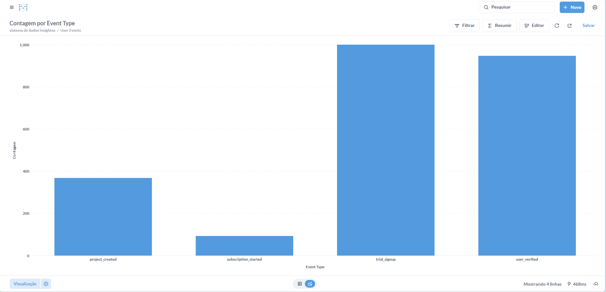

># 3. Geração de Dados Sintéticos

>### 3.1 Justificativa
A geração de dados sintéticos foi uma decisão estratégica adotada na fase inicial do projeto. A principal razão foi a necessidade de criar um *ambiente de laboratório controlado*, que permitisse realizar testes rigorosos sem as limitações associadas aos dados do mundo real, como escassez ou excesso de ruídos. Essa abordagem possibilitou:
1. *Validar o Pipeline:* Garantir que o pipeline de ponta a ponta (coleta, API, banco de dados e visualização em BI) estava funcionando corretamente.  
2. *Criar Padrões Realistas:* Injetar intencionalmente padrões e correlações plausíveis nos dados. Por exemplo, simular que a campanha google_gestao_agil apresenta uma maior taxa de conversão.  
3. *Testar Modelos:* Construir um "quebra-cabeças" com uma solução previamente conhecida, para verificar se os modelos de machine learning (ML) e *Lifetime Value (LTV)* eram capazes de identificar os padrões incorporados.
---
>### 3.2 Implementação
O processo de geração de dados foi elaborado no notebook 01_data_simulation.ipynb, utilizando as bibliotecas *pandas* para manipulação de DataFrames e *faker* para criar dados fictícios, mas com aparência real, como nomes e endereços de e-mail.
#### 1. Simulação do Funil de Conversão (Lead Scoring)
A estratégia central foi a criação de um funil probabilístico, no qual eventos-chave dependiam de uma cascata de decisões baseadas em probabilidades condicionais. Essa abordagem permitiu modelar o comportamento de *usuários* de forma realista, em vez de utilizar eventos aleatórios.

>##### Lógica de Transição
A lógica foi projetada para que a progressão de um *usuário* no funil fosse dependente de ações anteriores e de fatores contextuais, como a campanha de origem. Por exemplo:
* Um *usuário* só poderia criar um projeto após verificar seu e-mail.  
* A probabilidade de realizar a ação de criar um projeto era configurada como *condicional* à campanha de aquisição do *usuário*.  
* Isso permitiu representar o comportamento simulado de campanhas que atraem *usuários* mais qualificados.
O trecho de código abaixo ilustra essa lógica:

python
# Lógica de simulação do funil
# Probabilidade de criação de projeto depende da campanha de aquisição
prob_create_project = 0.55 if user['acquisition_campaign'] == 'google_gestao_agil' else 0.30

# O evento só ocorre se a condição probabilística for satisfeita
if random.random() < prob_create_project:
    # Gera o evento 'project_created' no funil
    events.append(...) 
    
    # Lógica aninhada para a próxima etapa do funil (assinatura)
    prob_subscribe = 0.40 if user['acquisition_campaign'] == 'google_gestao_agil' else 0.15
    if random.random() < prob_subscribe:
        events.append(...)
        # Atualiza o status do usuário na base de dados
        users_df.loc[users_df['user_id'] == user_id, 'status'] = 'converted'

---
>#### 2. Simulação de Transações (LTV)
Para a análise de *Lifetime Value (LTV)*, foi desenvolvido um segundo script que gerava um log de transações simuladas. Assim como na simulação do funil de conversão, os dados foram enviesados intencionalmente para refletir diferenças entre os clientes de diferentes campanhas. Destaques da configuração:
* *Maior probabilidade de recompra:* Clientes provenientes da campanha google_gestao_agil apresentaram maior chance de realizar compras recorrentes.  
* *Ciclo de compra mais curto:* Esses clientes realizaram compras em intervalos menores.  
* *Ticket médio superior:* Os valores monetários por transação foram configurados para serem maiores em comparação às demais campanhas.
---
>### 3.3 Avaliação da Qualidade e Desafios
A qualidade dos dados foi validada com base na sua capacidade de serem inseridos corretamente no banco de dados e analisados posteriormente. Durante o processo de inserção, foram enfrentados e resolvidos alguns desafios técnicos:

1. **Duplicate key value... users_pkey:**  
   Esse erro ocorreu devido à tentativa de inserir registros duplicados na chave primária da tabela users. A solução foi limpar as tabelas antes de cada rodada de inserção para garantir que o ambiente de teste estivesse limpo e sem dados residuais.
2. **Duplicate key value... users_email_key:**  
   Esse problema ocorreu devido à geração de endereços de e-mail duplicados pela biblioteca *faker*. A solução foi implementar uma lógica de verificação, garantindo que nenhum e-mail repetido fosse gerado durante o processo de simulação.
3. *Out of range float values...:*  
   Esse problema foi causado pela incompatibilidade entre valores np.nan (gerados pelo Pandas) e o formato JSON requerido pelo banco de dados, que espera null. A solução envolveu converter os valores np.nan em None (nativo do Python), que é compatível com o formato null do PostgreSQL.

A *validação final* dos dados foi realizada de forma visual por meio do Metabase. Um gráfico de funil (Figura 2) foi gerado para verificar se toda a lógica probabilística foi corretamente aplicada e armazenada na base de dados. A análise confirmou que os padrões simulados estavam sendo representados adequadamente.

