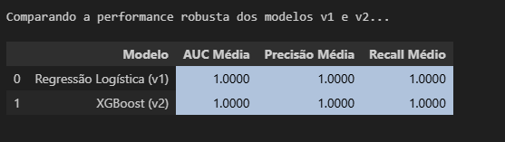

# 4. Modelagem de Lead Scoring

### 4.1 Estratégia
O objetivo era prever a variável-alvo `target_converted` (1 para convertido, 0 para não convertido). A estratégia de modelagem foi:

1.  **Engenharia de Atributos:** Transformar os logs de eventos brutos (`user_events`) numa `feature_table` estática, onde cada linha é um utilizador e cada coluna uma característica (ex: contagem de `project_created`).
2.  **Tratamento de Desequilíbrio:** A EDA revelou que apenas 10.1% dos utilizadores eram "convertidos". A técnica `class_weight='balanced'` foi usada no modelo para dar mais importância à classe minoritária e evitar que o modelo a ignorasse.
3.  **Experimentação Comparativa:** Treinar um modelo *baseline* simples e interpretável (Regressão Logística) e compará-lo com um modelo complexo e de alta performance (XGBoost) .
4.  **Decisão Baseada em Parcimônia:** Como ambos os modelos atingiram 100% de performance nos dados sintéticos, o **Princípio da Parcimônia** foi aplicado: a solução mais simples (Regressão Logística) foi escolhida por ser mais interpretável, eficiente e menos propensa a *overfitting*.

### 4.2 Detalhes Técnicos
O processo de modelagem foi encapsulado num `Pipeline` do Scikit-learn, garantindo que o pré-processamento fosse aplicado de forma consistente.

**1. Pipeline de Pré-processamento:**
Um `ColumnTransformer` foi usado para aplicar diferentes transformações a diferentes colunas:
* **Colunas Numéricas (ex: `events_project_created`):** Aplicado `StandardScaler()` para padronizar os dados (colocá-los na mesma escala).
* **Colunas Categóricas (ex: `campaign`):** Aplicado `OneHotEncoder()` para transformar texto em colunas numéricas (0/1). O parâmetro `handle_unknown='ignore'` foi usado para tornar o modelo robusto a novas campanhas que possam surgir no futuro.

**2. Código do Pipeline (Estrutura):**
A estrutura final do pipeline, que combina pré-processamento e o modelo, é mostrada abaixo.

```python
from sklearn.pipeline import Pipeline
from sklearn.compose import ColumnTransformer
from sklearn.preprocessing import StandardScaler, OneHotEncoder
from sklearn.linear_model import LogisticRegression

# Definir as colunas para cada transformador
numeric_features = ['events_project_created', 'events_subscription_started', ...]
categorical_features = ['campaign', 'plan', ...]

# Criar o pré-processador
preprocessor = ColumnTransformer(
    transformers=[
        ('num', StandardScaler(), numeric_features),
        ('cat', OneHotEncoder(handle_unknown='ignore'), categorical_features)
    ])

# Criar o pipeline final v1 (Regressão Logística)
lr_pipeline = Pipeline(steps=[
    ('preprocessor', preprocessor),
    ('classifier', LogisticRegression(class_weight='balanced', random_state=42))
])

# Treinar o modelo
lr_pipeline.fit(X_train, y_train)

# Salvar o pipeline inteiro para produção
import joblib
joblib.dump(lr_pipeline, 'lead_scoring_pipeline_v1.joblib')

**3. Métricas de Avaliação:**
A avaliação robusta (teste único e Validação Cruzada) confirmou a performance perfeita do pipeline nos dados simulados:
* **AUC:** 1.0000 
* **Precisão:** 1.0000 
* **Recall (Sensibilidade):** 1.0000 
* **Desvio Padrão (Validação Cruzada):** 0.0000, indicando estabilidade total.

Essa performance perfeita validou que o pipeline técnico era 100% funcional e capaz de "resolver" o problema "fácil" que os dados sintéticos apresentavam.

O log abaixo (do ficheiro `modelo v2.png`) mostra a performance robusta do Modelo v2 (XGBoost), que também alcançou a perfeição:


A tabela de comparação final abaixo (do ficheiro `Celula 11...png`) resume a 'batalha' dos modelos e prova que ambas as performances foram idênticas, validando a nossa decisão pelo "Princípio da Parcimônia" (escolher o Modelo v1, mais simples):



### 4.3 Análise Visual de Resultados e Insights

**1. Funil de Conversão (Contexto EDA)**
O gráfico de funil abaixo, gerado durante a Análise Exploratória de Dados (EDA), foi crucial para contextualizar o problema. Ele identificou o maior ponto de atrito na jornada do cliente:
* **Ponto Crítico:** A maior quebra ocorre entre as etapas `user_verified` e `project_created`, onde menos da metade (41.5%) dos utilizadores engajados avança.
* **Implicação:** Esta etapa (`project_created`) é um dos preditores mais fortes para o modelo de scoring.


**2. Distribuição dos Scores do Modelo**
Este gráfico mostra o resultado final do nosso modelo (Regressão Logística v1) aplicado a todos os 1.000 utilizadores.
* **Descoberta:** O resultado é uma distribuição marcadamente bimodal, indicando que o modelo é extremamente decisivo.
* **Grupo Frio (Score ≈ 0.0):** A grande maioria dos leads (cerca de 90%) foi classificada com confiança como "fria".
* **Grupo Quente (Score ≈ 1.0):** Um segundo grupo claro (os restantes 10%) foi classificado com confiança como "quente". 
* **Implicação:** A ausência de scores intermédios (ex: 0.4, 0.5) é uma vitória para o negócio, pois elimina a ambiguidade e permite à equipa de vendas focar-se apenas no grupo "quente".


**3. Insight de Negócio: Qualidade Média por Campanha**

Finalmente, este gráfico conecta o resultado do modelo (o `lead_score`) de volta ao problema de negócio (investimento de marketing).
* **Descoberta:** A campanha `google_gestao_agil` (score médio de 0.245) atrai leads de qualidade esmagadoramente superior a todas as outras fontes 
* **Implicação de ROI:** Esta é a principal recomendação para a equipa de Marketing. O gráfico prova que o orçamento deve ser realocado para esta campanha, pois ela gera os leads com maior probabilidade de conversão, otimizando o ROI .

