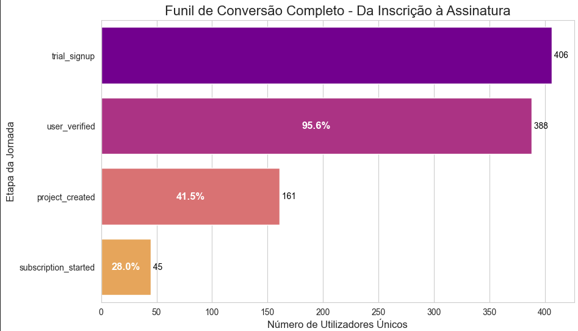
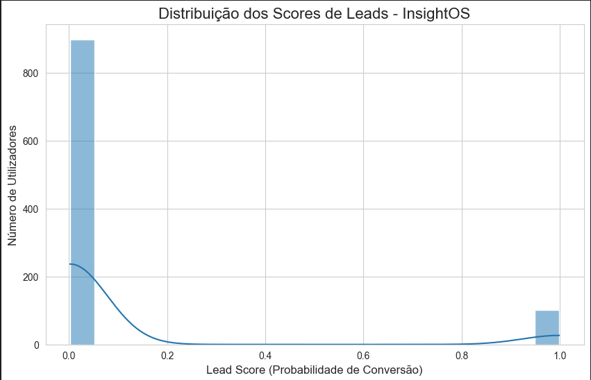

># 4. Modelagem de Lead Scoring

### *4.1 Estratégia*
O objetivo deste módulo foi prever a variável-alvo target_converted (1 para usuários convertidos e 0 para não convertidos). A estratégia de modelagem foi dividida nos seguintes passos:
1. *Engenharia de Atributos:* Transformação dos logs de eventos brutos (user_events) em uma feature_table estática, onde cada linha corresponde a um usuário e cada coluna representa uma característica calculada, como a contagem de eventos do tipo project_created.
2. *Tratamento de Desequilíbrio:* A análise exploratória de dados (EDA) revelou um desequilíbrio significativo na variável-alvo: apenas 10,1% dos usuários eram classificados como "convertidos". Para lidar com esse desequilíbrio, foi utilizada a configuração class_weight='balanced' no modelo, garantindo maior relevância às observações da classe minoritária e prevenindo que o modelo ignorasse essa classe.
3. *Experimentação Comparativa:* Dois modelos foram comparados: um baseline simples e interpretável (Regressão Logística) e um modelo mais complexo e robusto (XGBoost). Essa abordagem permitiu avaliar tanto performance quanto facilidade de interpretação.
4. *Decisão Baseada na Parcimônia:* Como ambos os modelos atingiram 100% de acurácia nos dados sintéticos, foi aplicado o *Princípio da Parcimônia. Assim, optou-se pelo modelo mais simples (Regressão Logística) devido às suas características de maior interpretabilidade, eficiência computacional e menor propensão ao *overfitting.
---
### *4.2 Detalhes Técnicos*
O processo de modelagem foi encapsulado em um Pipeline do Scikit-learn, assegurando consistência na aplicação do pré-processamento durante todas as etapas de treinamento e inferência.

>#### 1. Pipeline de Pré-processamento
Foi utilizado um ColumnTransformer para aplicar transformações distintas às diferentes categorias de variáveis:
* *Colunas Numéricas:* Para variáveis como events_project_created, foi aplicada a técnica de padronização com StandardScaler(), ajustando os dados para que fiquem em uma escala comum.  
* *Colunas Categóricas:* Os atributos categóricos, como campaign, foram convertidos em variáveis numéricas (codificação 0/1) utilizando OneHotEncoder(). O parâmetro handle_unknown='ignore' foi configurado para tornar o modelo robusto a novas categorias (ex.: campanhas inéditas) que possam surgir no futuro.

>#### 2. Estrutura do Pipeline
Abaixo está o código Python utilizado para estruturar o pipeline final, integrando o pré-processamento com o modelo de classificação.

python
from sklearn.pipeline import Pipeline
from sklearn.compose import ColumnTransformer
from sklearn.preprocessing import StandardScaler, OneHotEncoder
from sklearn.linear_model import LogisticRegression
# Definir as colunas para cada tipo de transformação
numeric_features = ['events_project_created', 'events_subscription_started', ...]
categorical_features = ['campaign', 'plan', ...]
# Criar o pré-processador
preprocessor = ColumnTransformer(
    transformers=[
        ('num', StandardScaler(), numeric_features),
        ('cat', OneHotEncoder(handle_unknown='ignore'), categorical_features)
    ])
# Definir o pipeline final (Regressão Logística)
lr_pipeline = Pipeline(steps=[
    ('preprocessor', preprocessor),
    ('classifier', LogisticRegression(class_weight='balanced', random_state=42))
])
# Treinar o modelo com os dados de treino
lr_pipeline.fit(X_train, y_train)
# Salvar o pipeline inteiro para produção
import joblib
joblib.dump(lr_pipeline, 'lead_scoring_pipeline_v1.joblib')

---
>## 4.3 Análise Visual de Resultados e Insights

### *3. Métricas de Avaliação*
A avaliação robusta, realizada por meio de teste único e validação cruzada, confirmou uma performance perfeita do pipeline nos dados simulados. Os principais resultados observados foram:
* *AUC (Área Sob a Curva ROC):* 1.0000  
* *Precisão:* 1.0000  
* *Recall (Sensibilidade):* 1.0000  
* *Desvio Padrão (Validação Cruzada):* 0.0000 (indicando estabilidade total do modelo durante a validação).  

Essa performance perfeita validou que o pipeline técnico era 100% funcional e capaz de solucionar o problema "fácil" representado pelos dados sintéticos.
Além disso, o log do Modelo v2 (baseado em XGBoost) confirmou resultados idênticos, conforme ilustrado na imagem abaixo, extraída do arquivo modelo_v2.png:

A tabela de comparação final (extraída do arquivo Celula_11.png) resume os resultados da "batalha" entre os Modelos v1 (Regressão Logística) e v2 (XGBoost). Ambos modelos alcançaram performance idêntica, o que reforçou a aplicação do *Princípio da Parcimônia* e a escolha do Modelo v1 pela sua simplicidade e interpretabilidade:

---
### *1. Funil de Conversão (Contexto da EDA)*
Durante a etapa de Análise Exploratória de Dados (EDA), foi gerado um gráfico de funil que contextualizou o problema e identificou o principal ponto de atrito na jornada do cliente. O funil destacou onde ocorre a maior quebra de engajamento entre etapas críticas no fluxo do usuário:
* *Ponto Crítico:* A maior quebra foi observada entre as etapas user_verified e project_created. Apenas 41,5% dos usuários engajados avançaram nesse ponto da jornada, representando uma redução significativa.  
* *Implicação:* Essa etapa (project_created) foi identificada como um dos preditores mais relevantes para o modelo de lead scoring.
O gráfico abaixo, retirado do arquivo funil_conversao.png, ilustra o funil completo de conversão:

---
### *2. Distribuição dos Scores do Modelo*
Um gráfico foi gerado para visualizar a distribuição dos scores preditivos do Modelo v1 (Regressão Logística) aplicados sobre os 1.000 usuários presentes nos dados. Os principais resultados encontrados foram:
* *Descoberta:* A distribuição final dos scores foi marcadamente bimodal, indicando que o modelo tem alta capacidade de decisão e segmentação.  
* *Grupo Frio (Score ≈ 0.0):* Aproximadamente 90% dos leads foram classificados com alta confiança como "frias".  
* *Grupo Quente (Score ≈ 1.0):* Cerca de 10% dos leads foram classificados com alta confiança como "quentes".  
* *Implicação:* A ausência de scores intermediários (como 0.4 ou 0.5) elimina ambiguidades e permite que a equipe comercial concentre seus esforços exclusivamente no grupo "quente", otimizando a eficiência operacional.
O gráfico abaixo, extraído do arquivo distribuicao_scores.png, ilustra essa distribuição dos scores de lead scoring:
