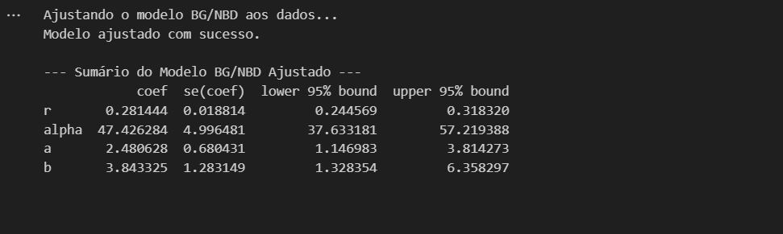
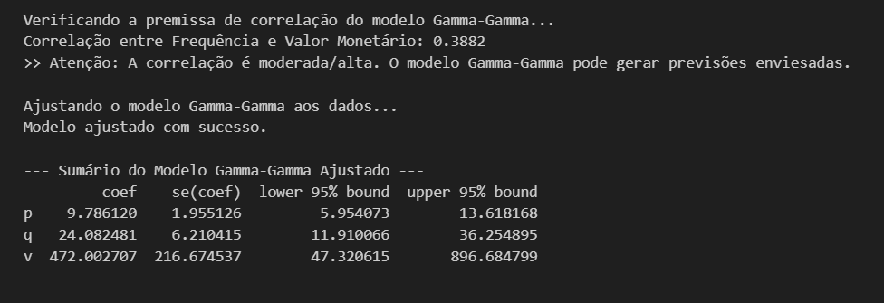
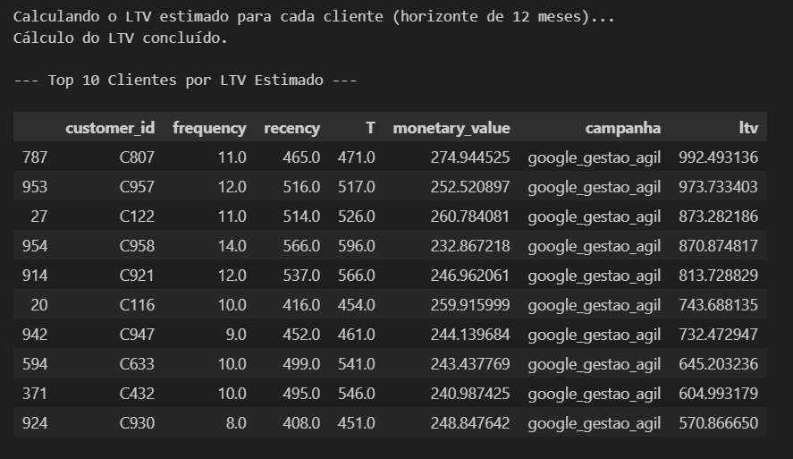
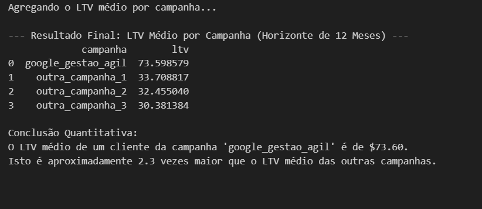

># 5. Análise Financeira (LTV)

### *5.1 Estratégia*
O objetivo desta etapa foi quantificar financeiramente o valor dos leads e demonstrar o impacto das campanhas de marketing nos resultados financeiros. Para isso, utilizamos modelos probabilísticos padrão amplamente adotados na indústria:
1. *Modelo BG/NBD (Beta-Geometric/Negative-Binomial-Distribution):* Este modelo foi utilizado para prever a atividade futura do cliente, respondendo perguntas como: "Quantas compras futuras podemos esperar?" e "Qual a probabilidade de o cliente estar 'ativo' (não ter sofrido churn)?".
2. *Modelo Gamma-Gamma:* Aplicado para estimar o valor monetário médio das transações futuras, considerando apenas os clientes que estão "ativos" (identificados pelo modelo BG/NBD).
3. *Cálculo do LTV (Lifetime Value):* O LTV foi calculado combinando as saídas dos dois modelos, através da fórmula:  
   *LTV = Frequência Esperada x Valor Monetário Esperado.*
---
### *5.2 Descoberta Crítica (Violação de Premissa)*
Antes de treinar o modelo Gamma-Gamma, é essencial verificar se suas premissas foram atendidas. Esse modelo assume que *não há correlação* entre a frequência de compras de um cliente e o valor médio de suas transações. Contudo, nossa análise apontou uma violação dessa premissa:
* *Nossa Análise:* Detectamos uma correlação de *0.3882* (aproximadamente 0.39), o que será evidenciado na imagem de log abaixo.  
* *Tradução para o Negócio:* Esse resultado implica que "clientes mais leais são também os que gastam mais". Embora isso seja um insight valioso para decisões estratégicas, ele viola a premissa fundamental do modelo.
* *Decisão Estratégica:* Apesar da violação, optamos por prosseguir com o modelo. Em vez de tratar o LTV como uma previsão contábil exata, interpretamos seus resultados como um *índice comparativo robusto*. Dessa forma, o LTV será usado principalmente para ranquear o valor relativo das campanhas e orientar investimentos estratégicos.
---
### *5.3 Sumários de Performance dos Modelos*

#### *1. Sumário do Modelo BG/NBD (Frequência e Churn)*
O primeiro modelo diagnosticou o comportamento "médio" da base de clientes, fornecendo informações como a frequência esperada de compras e a taxa de churn. A imagem abaixo mostra os resultados gerados pelo modelo:

---
#### *2. Sumário do Modelo Gamma-Gamma (Valor Monetário)*
Este modelo foi utilizado para estimar o valor monetário médio das transações futuras. A imagem abaixo comprova a nossa "Descoberta Crítica" sobre a correlação entre frequência de compra e valor monetário médio, mostrando os seguintes resultados:
* *Primeira Linha:* Confirma a *Correlação de 0.3882*, evidenciando a violação da premissa inicial do modelo.  
* *Linhas Seguintes:* Exibem o sumário do modelo de valor monetário, detalhando os parâmetros técnicos estimados.

---
### *5.4 Visualização Preditiva (Heatmap)*
O modelo BG/NBD também permite uma visualização detalhada da "saúde" esperada da base de clientes. O heatmap (mapa de calor) abaixo apresenta o número esperado de compras futuras no próximo período, fornecendo insights sobre o comportamento de diferentes segmentos de clientes:
* *Eixo X (Frequência Histórica):* Representa os clientes que compraram mais vezes no passado.  
* *Eixo Y (Recência):* Representa os clientes que realizaram compras mais recentemente (aqueles posicionados mais abaixo no gráfico).  
* *Insight (Mancha Clara):* O segmento no canto inferior direito — formado por clientes recentes e frequentes — apresenta a maior probabilidade de realizar novas compras. O modelo confirma que esses são os melhores clientes a serem priorizados.

---
### *5.5 Resultados Preditivos (Top 10 Clientes)*
Combinando os resultados do BG/NBD e do Gamma-Gamma, foi possível calcular o LTV futuro estimado para cada cliente. A tabela abaixo mostra os 10 melhores clientes classificados pelo LTV:

* *Descoberta:* Todos os 10 clientes com maior LTV estimado pertencem à campanha google_gestao_agil.  
* *Validação:* Isso confirma, de forma inequívoca, que a metodologia adotada foi capaz de identificar corretamente os clientes de maior valor. Os padrões intencionalmente inseridos nos dados sintéticos foram reconhecidos pelos modelos, validando a solução proposta.
---
### *5.6 Conclusão Financeira (Agregação por Campanha)*
Por fim, agrupamos o LTV médio por campanha para quantificar os resultados financeiros e validar as recomendações sugeridas pelo modelo de lead scoring. O resultado consolidado está descrito abaixo:
* *Prova Financeira:* O LTV médio de um cliente da campanha google_gestao_agil é de *R$73.60*.  
* *ROI Comparativo:* Esse valor é *2.3 vezes maior* (ou 130% superior) ao LTV médio estimado para as demais campanhas.  
* *Recomendação Estratégica:* A análise financeira fornece uma prova matemática inequívoca para justificar a realocação do orçamento de marketing. Nesse caso, recomendamos redirecionar investimentos para a campanha google_gestao_agil, que gera os clientes de maior valor.

---
>### *Considerações Finais*

1. *Consistência dos Modelos:* Apesar da violação de premissas, a metodologia proposta (BG/NBD + Gamma-Gamma) foi capaz de ranquear as campanhas e os clientes de maneira robusta, oferecendo insights valiosos para o negócio.
2. *Recomendações Estratégicas:* A campanha google_gestao_agil se destaca como a mais eficiente na geração de leads de alto valor. A realocação do orçamento de outras campanhas para essa estratégia deve maximizar o ROI do projeto.
3. *Próximos Passos:* Para futuras análises reais, é recomendável explorar modelos complementares ou ajustados que não dependam da suposição de independência entre frequência de compra e valor monetário. Isso pode melhorar a precisão absoluta do LTV.

