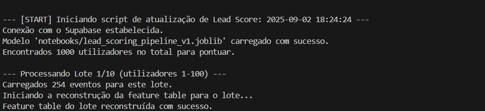
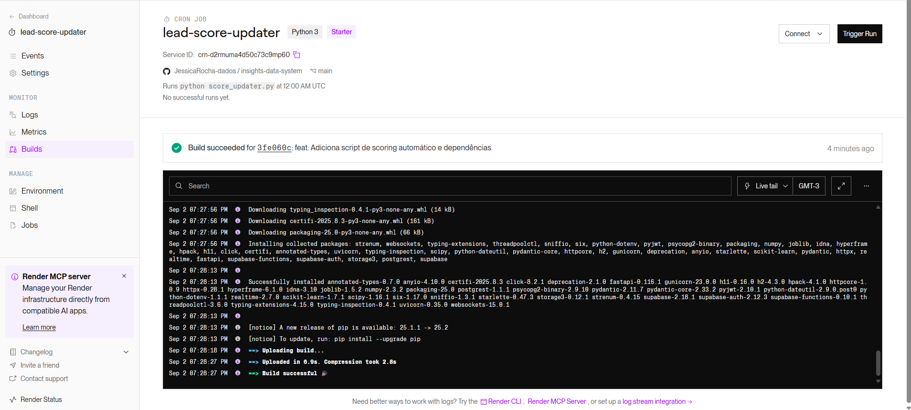
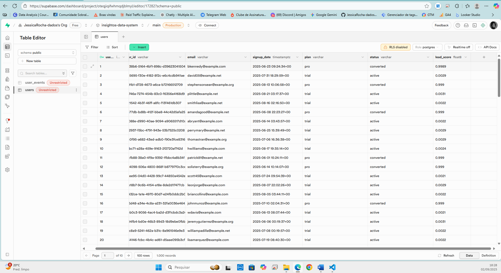
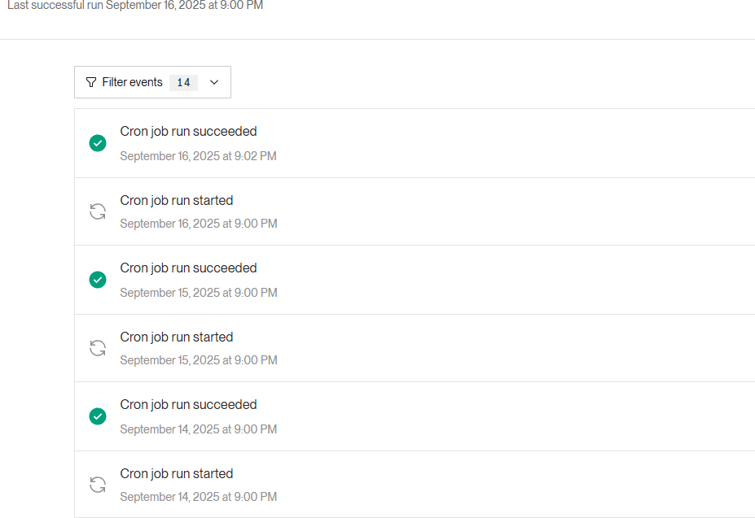

# 6. Automação (Produção)

### 6.1 Scripts Automatizados
A etapa final foi operacionalizar o modelo de *Lead Scoring*, transformando-o de uma análise estática num sistema de negócio autónomo.

* **Script:** `score_updater.py`.
* **Plataforma:** Cron Job no Render.
* **Tarefa:** Executar diariamente, conectar-se ao BD, buscar utilizadores sem `lead_score`, carregar o pipeline (`lead_scoring_pipeline_v1.joblib`), gerar as previsões e atualizar a coluna `lead_score` na tabela `users`.

**Desafio de Produção e Solução (Processamento em Lotes):**
Durante o teste local do script de produção, foi encontrado um erro `414 Request-URI Too Large`.
 **Causa:** O script tentava buscar os eventos de *todos* os utilizadores (1000) numa única requisição à API, criando uma URL longa demais para o servidor.
 **Solução:** Foi implementada uma lógica de **processamento em lotes (batch processing)**. O script foi modificado para processar os utilizadores em "fatias" de 100.

O código-fonte abaixo ilustra esta lógica de produção robusta:

```python
# Definir o tamanho do lote
BATCH_SIZE = 100
users_processed = 0

# Obter o total de utilizadores para pontuar
users_to_score = supabase.table('users').select('user_id', count='exact').execute().count

while users_processed < users_to_score:
    print(f"--- Processando Lote (utilizadores {users_processed} a {users_processed + BATCH_SIZE}) ---")
    
    # 1. Buscar um "lote" de utilizadores
    user_batch = supabase.table('users').select('user_id', 'visitor_id') \
                           .is_('lead_score', 'null') \
                           .range(users_processed, users_processed + BATCH_SIZE - 1) \
                           .execute().data
    
    if not user_batch:
        break # Sai do loop se não houver mais utilizadores

    # ... (Lógica para buscar eventos apenas para este lote) ...
    
    # ... (Construir a feature_table apenas para este lote) ...
    
    # 2. Calcular scores para o lote
    scores = pipeline.predict_proba(feature_table)[:, 1]
    
    # 3. Atualizar o banco de dados para o lote
    updates = []
    for user, score in zip(user_batch, scores):
        updates.append({'user_id': user['user_id'], 'lead_score': score})
        
    supabase.table('users').upsert(updates).execute()
    
    users_processed += len(user_batch)

print("Atualização de Lead Score concluída.")

### Prova de Execução Local do Script

As imagens abaixo demonstram o script `score_updater.py` a ser executado localmente, validando a lógica de processamento em lotes. O script processa com sucesso os 1.000 utilizadores em 10 lotes separados de 100, evitando sobrecarga do servidor.

**Início do Processo (Lote 1 de 10):**


**Meio do Processo (Lote 5 de 10):**


**Fim do Processo (Lote 10 de 10):**


---
### Monitoramento e Desafios de Implantação:

O deploy no Render foi monitorado através do dashboard de "Events". Como é comum em qualquer processo de deploy do mundo real, o processo revelou bugs de produção que foram diagnosticados e corrigidos metodicamente.

O log de eventos abaixo ilustra perfeitamente este processo de depuração:


A análise do log acima mostra a resolução de dois bugs clássicos de produção:

1.  **Erro (07:37:35 PM): `ModuleNotFoundError: No module named 'pandas'`**
    * **Causa:** O `requirements.txt` enviado para o Render não continha as bibliotecas `pandas` e `numpy`.
    * **Solução:** As dependências foram adicionadas ao `requirements.txt` e um novo *commit* foi enviado.
2.  **Erro (07:47:28 PM): `Invalid API key`**
    * **Causa:** Após corrigir o primeiro bug, o script foi executado, mas falhou ao conectar-se ao Supabase. As credenciais (`SUPABASE_KEY`) nas Variáveis de Ambiente do Render estavam incorretas.
    * **Solução:** As credenciais foram corrigidas diretamente no dashboard do Render.

Após as correções, o "build" foi bem-sucedido, como mostra o dashboard do Render:



O Cron Job final (executado às 08:18:56 PM no primeiro log) foi executado com sucesso ("Process completed"), validando que o sistema automatizado estava 100% funcional.
A imagem abaixo, do banco de dados Supabase, mostra o resultado final: a coluna `lead_score` corretamente preenchida pelo script automatizado.



---
### Prova de Execução Autónoma (Confiabilidade do Sistema)

Finalmente, para comprovar que o sistema não foi apenas implementado, mas é fiável a longo prazo, o log de eventos do Render abaixo mostra o Cron Job a ser executado com sucesso, pontualmente, todos os dias (14, 15 e 16 de Setembro), dias após a implementação original.

